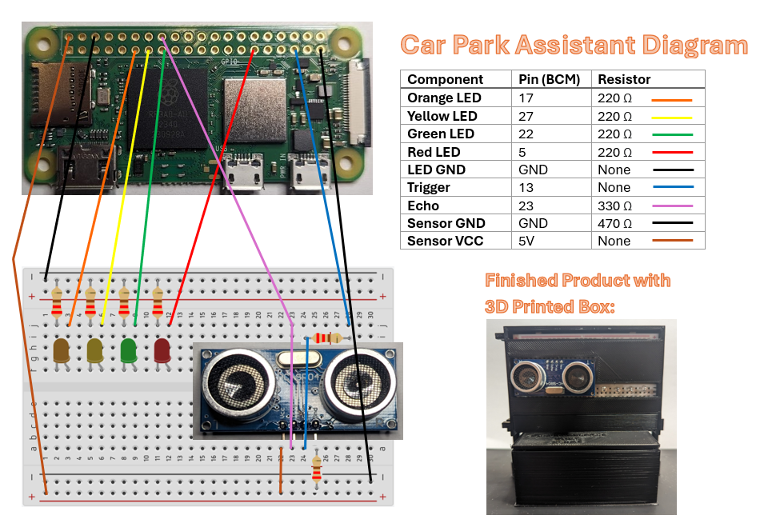

# Parkinging Assistant

## Project Description

This project was inspired by the small space in which we park a large van. The space between where the front of the car needs to sit to be able to close the garage, and where the car hits the wall of the garage is relatively small. This sensor was installed to give the driver a visual cue as to where exactly the front of the car is, and how far it is from the wall.

The program is set to only check for a distance every 1 second (this can be adjusted in the `config.py` file) while the distance measured is greater than 300cm (also adjustable).

## Diagram

## Using the program

### Setting Up the Device

Simply plug the device in to power it up. (MicroUSB port closest to the edge on the Pi Zero.)

As the car approaches the device, the lights will signal in the following order, with their meanings listed beside them:  
&emsp;Orange: The device sees you. **If you do not see an orange light as you approach, assume the device is not working properly.**
&emsp;Yellow: Getting close, not in parking zone yet.
&emsp;Green: Within parking tolerance.
&emsp;Red: TOO CLOSE. Back up.

See below for more details on setting the distance tolerances.

### Adjusting The Distance Indicators

**These are the most commonly used values in the configuration file.** These varialbes control the maximum distance (in centimeters) at which that LED will indicate. The order of indication should match the order below. (Red should always be lowest, orange should always be highest.):

**`RED_LED_MAX_DISTANCE`**  
 **`GREEN_LED_MAX_DISTANCE`**  
 **`YELLOW_LED_MAX_DISTANCE`**  
 **`ORANGE_LED_MAX_DISTANCE`**

> **These variables should be left alone unless you have a firm understanding of the code.**
>
> **`ACTIVE_SLEEP_TIME`** - This controls the amount of time between distance checks while someone is actively parking.
>
> **`PASSIVE_SLEEP_TIME`** - This controls the amount of time between distance checks while no object is detected.
>
> **`TRIG`** - Sets the pin for the trigger on the ultrasonic sensor.
>
> **`ECHO`** - Sets the pin for the receiver on the ultrasonic sensor.
>
> **`PULSE_DURATION_MULTIPLIER`** - Sets the multiplier for calculating the distance from the sensor. (34330/2 = 17165)
>
> **`RED_LED`** - Sets the pin number for the orange LED indicator.
>
> **`GREEN_LED`** - Sets the pin number for the orange LED indicator.
>
> **`YELLOW_LED`** - Sets the pin number for the orange LED indicator.
>
> **`ORANGE_LED`** - Sets the pin number for the orange LED indicator.
>
> **`LED_ARRAY`** - An array of all LED values used to loop through values.
